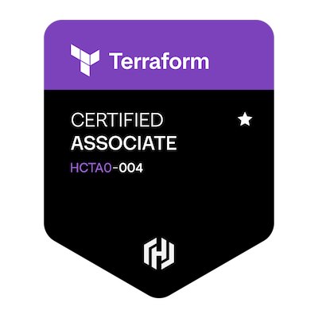
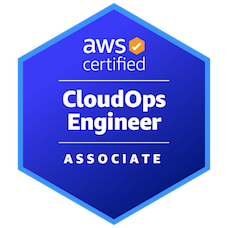
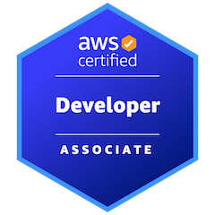
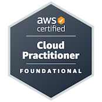

<h1 align="center">Hi 👋, I'am David</h1>

A passionate Software engineer that loves to learn a lot about software development everydays. I am currently working as full stack developer where I can apply all this knowledge to help people with solutions. I also like traveling, meeting new cultures, new places, and new people.

- 🌱 I’m currently studying for new Azure associate certification

## Certifications

<a href="https://www.credly.com/badges/48885000-004e-4202-a982-ca324016728c/public_url" target="_blank" rel="noopener noreferrer">
    
</a

<a href="https://www.credly.com/badges/1691f35d-e4e1-49dc-9511-ff3dd1aaaf4a/public_url" target="_blank" rel="noopener noreferrer">
    
</a

<a href="https://www.credly.com/badges/3e9ae867-c358-4bf5-b22c-e23056bbc733/public_url" target="_blank" rel="noopener noreferrer">
    
</a

<a href="https://www.credly.com/badges/611529fe-06ca-4d99-9153-9de1f5ed2923/public_url" target="_blank" rel="noopener noreferrer">
    
</a

<a href="https://www.credly.com/badges/db3aaaad-ee3c-494e-aff6-7dc5549cd089/public_url" target="_blank" rel="noopener noreferrer">
    
</a

    

